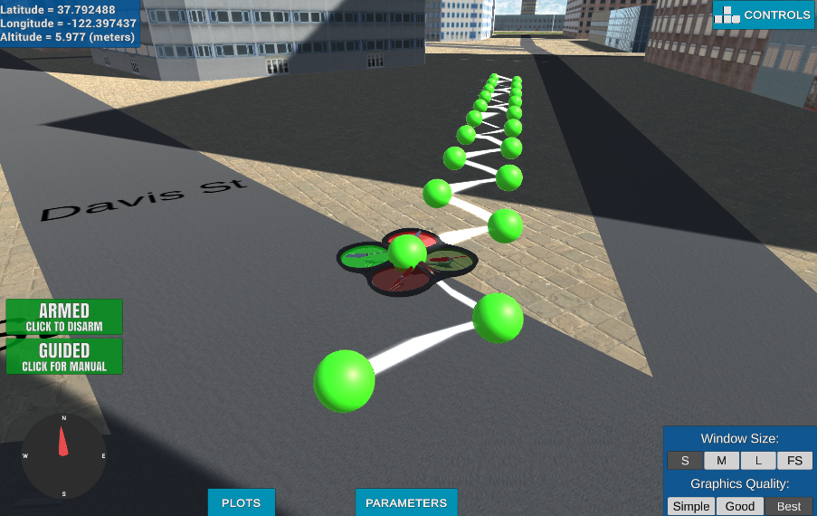

## Project: 3D Motion Planning

---

# Required Steps for a Passing Submission:
1. Load the 2.5D map in the colliders.csv file describing the environment.
2. Discretize the environment into a grid or graph representation.
3. Define the start and goal locations.
4. Perform a search using A* or other search algorithm.
5. Use a collinearity test or ray tracing method (like Bresenham) to remove unnecessary waypoints.
6. Return waypoints in local ECEF coordinates (format for `self.all_waypoints` is [N, E, altitude, heading], where the drone’s start location corresponds to [0, 0, 0, 0].
7. Write it up.
8. Congratulations!  Your Done!

## [Rubric](https://review.udacity.com/#!/rubrics/1534/view) Points
### Here I will consider the rubric points individually and describe how I addressed each point in my implementation.  

---
### Explain the Starter Code

#### 1. Explain the functionality of what's provided in `motion_planning.py` and `planning_utils.py`
The script added an extra state to the previous project: PLANNING. This is the stage in which we will calculate waypoints and use them to navigate through the city.

In plan_path() in the starter code, we initialize the home, start, and goal positions. Next, we creates a 2.5D grid based on colliders.csv; this is done in planning_utils.create_grid. Finally, we set a couple of waypoints that are found using planning_utils.a_star(). Because the starter code a_star method has no diagonal actions, the resulting path is a zigzaggy path from start to goal.

### Implementing Your Path Planning Algorithm

#### 1. Set your global home position
Global home position is extracted from colliders.csv by reading the first line, splitting by ",", then spltting by " ". The resulting numbers are used to passed to self.set_home_position()

#### 2. Set your current local position
The local position is found by calculating the offset of the drone's global positon against the global home position. The method frame_utils.global_to_local is already provided and used.

#### 3. Set grid start position from local position
The grid start position is calculated by the difference between the local position and the north-eastern corner of the grid. 

#### 4. Set grid goal position from geodetic coords
The grid goal is calculated by 1) converting an arbitrary lat lon into local coordinates and 2) converting the local coordinates into grid coordinates.

#### 5. Modify A* to include diagonal motion (or replace A* altogether)
4 actions - north east, north west, south east, and south west were added to the valid actions with cost sqrt(2). This was enough for the provided A* algorithm to support diagonal motion.

#### 6. Cull waypoints 
To cull waypoints, I used a collinearity test to remove unnecessary waypoints in between. This is not perfect, however, as certain paths that have many zigzag patterns are not collinear and thus not simplified.

### Execute the flight
#### 1. Does it work?
It works! See motion_planning.mov for sample run.

